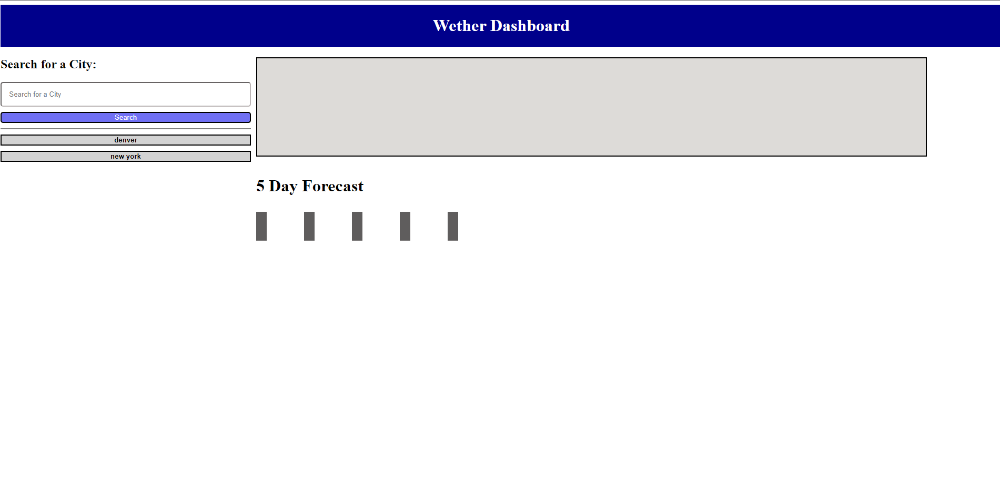
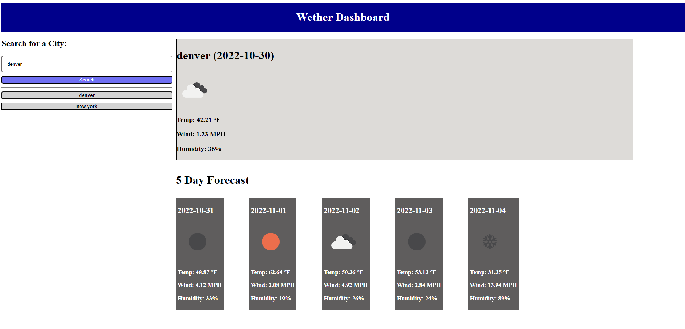

# Whats The Wether

## Description

This program will display the wether as well as the forecast for the next five days for a city the user inputs
The https://openweathermap.org/forecast5 api was used for the creation of the site

## Installation

N/A

## Usage

This project is a dashboard for someone looking to travel and would like to see the wether conditions of the area they would like to visit 

## Credits

N/A

## License
Please refer to the LICENSE in the repo.

## Screen Shots

## Links
[An Internal Link]()
